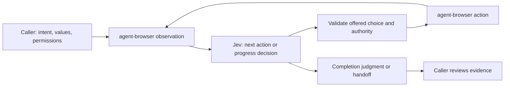

# Agent Browser Jev

**Give your agent a browser intent. Let Jev handle the next few UI decisions.**

`agent-browser-jev` is an Agent Skill with a small JavaScript helper that uses Jev to choose actions from the current [agent-browser](https://github.com/vercel-labs/agent-browser) accessibility snapshot. It executes through your existing browser session, observes the result, and continues until it reports completion or returns control to the calling agent.

The caller supplies the goal, permissions and exact input values. Jev interprets labels and surrounding context. Agent-browser performs the gestures. The caller checks the final evidence.

**Version:** 0.1.0. Live acceptance currently covers supervised read-only Xero interactions. The implementation is generic; those results do not establish reliability across every website or authorize accounting writes.

## Why it was built

Browser automation often spends more time on the caller's repeated model/tool round trips than on the click itself. A capable agent may need to inspect a page, pick one control, issue a command, inspect again, and repeat—even for a short task it already understands.

We built this helper to keep those bounded interaction loops close to the browser. Jev makes the small, contextual decisions while the main agent retains the larger task and business judgment.

The initial experiments also exposed a trap: hard-coding row parsers, exact label sequences and screen-specific completion checks made the surrounding code duplicate the model's work. This implementation instead presents observed controls and their context to Jev. Code enforces mechanical boundaries: offered IDs, literal values, request binding, caller permissions and execution budgets.

The approach draws on [Browserbase's Jev integration](https://www.browserbase.com/blog/what-is-jev) and [Retriever's browser-action experiments](https://rtrvr.ai/blog/jev-browser-agent-benchmark): keep a capable caller in charge, ground choices against actual browser observations, and provide a way to hand back uncertainty. Our measurements below are our own development results, not those articles' benchmarks.

## When to use it

- Short tasks involving repeated labels, contextual controls or several UI transitions.
- Opening and closing details, reviewing a panel, or similar authorized interactions in an existing session.
- Work where avoiding per-click caller decisions is useful, while final verification can stay with the caller.

A direct agent-browser command is simpler when you already know the current reference. A maintained deterministic script may be faster for a stable, well-defined flow. The helper does not replace available application APIs, authorization policies, a full task planner, or business-specific verification.

## Installation with `npx skills`

Install just this skill from the collection:

```sh
npx skills add gabeosx/agent-skills --skill agent-browser-jev
```

For a project-local Codex installation without interactive prompts:

```sh
npx skills add gabeosx/agent-skills --skill agent-browser-jev --agent codex --yes
npm --prefix .agents/skills/agent-browser-jev ci --ignore-scripts --no-audit --no-fund
```

For a global Codex installation:

```sh
npx skills add gabeosx/agent-skills --skill agent-browser-jev --agent codex --global --yes
npm --prefix "${CODEX_HOME:-$HOME/.codex}/skills/agent-browser-jev" ci --ignore-scripts --no-audit --no-fund
```

For another supported agent, choose it interactively or change `--agent`. Run `npm ci` in the installed skill directory reported by the installer. The [official skills CLI documentation](https://github.com/vercel-labs/skills#readme) explains agent selection, project/global scope and symlink/copy installation. **Installing skill files does not install their npm dependencies.** Repeat `npm ci` after updating the skill.

Before using the helper, provide:

| Requirement | Purpose |
| --- | --- |
| Node.js 20.3+ and npm | Run the helper and install its pinned SDK dependency. |
| An existing agent-browser executable and session | Supply the binary path and session ID. Keep your chosen fork and credential provider. |
| An OpenRouter key with access to `typesafe/jev-1.13` | Supply it through a secret provider or inherited `OPENROUTER_API_KEY`. |
| Caller authorization and privacy functions | Define which effects are permitted and which page content may reach Jev. |

The live pilot used an agent-browser fork reporting version 0.33.2 with a Bitwarden credential provider. Other builds must support the JSON snapshot/ref and action interface used here. No browser installation, fork replacement, Bitwarden setup, login or credential migration happens automatically. Follow your selected binary's `skills get core` guidance for setup.

## Using the skill with an agent

For example:

> Use $agent-browser-jev in the existing portal session to open the April statement's details, then close them and return to the list. This is read-only: don't edit, select or submit anything. Use the project's existing browser permissions and privacy filter, and show me the final result.

The skill tells the agent how to invoke the bundled helper. The example still needs a configured browser, Jev credentials and appropriate caller policy. It does not authorize every control on the page.

The caller can supply one bounded intent or a short list of intents. Jev chooses the next action and decides when to advance; the helper does not encode the website's button sequence.

## Command-line quick start

The CLI takes a task file, a trusted caller policy module and a new private output path:

```sh
node .agents/skills/agent-browser-jev/scripts/run.mjs \
  --task private/browser-task.json \
  --policy ./browser-policy.mjs \
  --output private/browser-result-001.json
```

Replace the skill path for a global or non-Codex installation. Task JSON:

```json
{
  "browser": {
    "binary": "/absolute/path/to/agent-browser",
    "sessionId": "portal"
  },
  "intentOrSteps": "Open the April statement details, then close them and return to the list.",
  "scope": "Only opening and closing statement details in the current authorized portal account.",
  "suppliedValues": {},
  "budget": {
    "maxActions": 6,
    "maxDecisions": 10,
    "timeoutMs": 45000
  }
}
```

`browser-policy.mjs` exports two functions and an optional credential loader:

```js
// Import your existing caller-owned policy and privacy functions.
export { authorize, sanitize } from './project-browser-policy.mjs';

// Optional: retrieve a key in memory from your configured secret provider.
export { loadApiKey } from './project-secrets.mjs';
```

Those imports are integration points, not files included in this skill. Their contracts are:

| Function | Contract |
| --- | --- |
| `authorize(action, observation)` | Return a synchronous boolean establishing whether this concrete action is allowed. Checked when offering candidates and again before dispatch. |
| `sanitize({snapshot, refs})` | Return the same shape with confidential visible data removed from both fields. Preserve reference IDs, roles and useful context. |
| `loadApiKey()` | Optionally return a string or promise from an existing secret provider. If omitted, the client uses inherited `OPENROUTER_API_KEY`. |

For a simple supervised task on a reviewed public page, a permission function might allow only that page's known read-only **Show details** and **Close** buttons. This restricts permitted effects; Jev still selects the correct item and action order. Do not reuse such a name list as a universal read-only classifier. A privacy filter may pass through content only when that content is already suitable to send to the model.

For that reviewed public-page example, the complete policy can be as small as:

```js
const reviewedReadOnlyButtons = new Set(['Show details', 'Close']);

export function authorize(action) {
  return action.op === 'click' && action.role === 'button' &&
    reviewedReadOnlyButtons.has(action.name);
}

// Appropriate only for the already-reviewed public page in this example.
export const sanitize = ({ snapshot, refs }) => ({ snapshot, refs });
// OPENROUTER_API_KEY is inherited from the configured secret environment.
```

For a private application, replace the pass-through filter with its actual redaction policy. Review the permitted controls for that application before adapting the example.

The skill intentionally does not decide which controls are safe across arbitrary websites. Reuse a project's existing policy rather than building a new row parser or runner for each task. Without the required CLI policy functions, execution fails before using the browser.

Keep API keys, passwords and OTPs out of task files, policy source, command arguments and model input. Browser authentication remains with the existing credential provider. Intents, supplied values, action labels and sanitized observations are model-visible.

## JavaScript API

The API supports callers that already manage browser policy and secret loading:

```js
import { act } from '/path/to/agent-browser-jev/scripts/jev-browser.mjs';
import {
  agentBrowser,
  createJevClient,
  jevDecider,
} from '/path/to/agent-browser-jev/scripts/agent-browser-jev.mjs';

const browser = agentBrowser({
  binary: configuredAgentBrowserPath,
  sessionId: existingSessionId,
  sanitize: projectPrivacyFilter,
});

const result = await act({
  browser,
  decide: jevDecider(createJevClient(await loadApiKey())),
  intentOrSteps: callerIntent,
  scope: authorizedScopeDescription,
  authorize: projectActionPolicy,
  suppliedValues: {},
  budget: { maxActions: 8, maxDecisions: 16, timeoutMs: 60000 },
});
```

Fill candidates use exact caller-supplied strings such as `{ searchText: 'April' }`; Jev can select a candidate but cannot replace its value. Live form behavior has not been established by the read-only pilot. See the [usage reference](references/usage.md) for session invalidation and detailed API behavior.

## How it works



The runtime consists of a bounded loop, an agent-browser/Jev adapter and a CLI. It discovers ordinary semantic controls, preserves the full current accessibility context, and offers click/fill candidates plus a short wait, completion and handoff. It refreshes observations after gestures and never executes an invented selector or a response against a substituted candidate map.

There is no second browser stack, separate fallback agent, Xero row parser, fixed outcome sequence or background service. Provider retries and fallback are disabled. Unsupported actions and exhausted budgets return to the same caller.

## Benchmarks and evidence

### Historical live comparison — September 24, 2026

These measurements came from the **development prototype**, before the generic packaged loop and its model-based completion handling. They explain the design decision; they are **not latency measurements of this package**.

Each task opened statement details, closed them, opened Find & Match, and cancelled back to the reconciliation list. Tests used two real statement rows in one Xero screen family, with repeated labels and changing references.

| Approach | Tasks completed without fallback | Measured task time | Main-agent action decisions during execution |
| --- | ---: | --- | ---: |
| Codex selecting each action from a fresh observation | 2/2 | 22.40–22.41 s | 4 per task |
| Original Jev formulation given the entire four-step task | 0/2 | Both handed off before clicking | Caller needed |
| Caller supplied four step intents; Jev grounded each step | 4/4 | 1.35–1.48 s; median 1.41 s | 0 |
| Deterministic lookup for the known row/control sequence | 2/2 | 0.41–0.70 s; median 0.56 s | 0 |

The successful Jev prototype episodes made 16 model decisions and 16 clicks, with no fallback or observed wrong-row result. Their total reported Jev provider charge was **$0.000858312**. That excludes the main agent's planning/review token costs; no comparable Codex dollar measurement was available. This is observed usage, not a current pricing promise.

The lesson is specific: batching the interaction loop removed per-click caller overhead. Deterministic execution was still fastest on the known sequences. Jev provides contextual interpretation without requiring a permanent script for each screen; this small study does not prove it beats maintained scripts or generalizes to unseen sites.

**Method and limits:** task timing included helper/client initialization, decisions, snapshots, gestures and readiness waits. Codex timing also included its tool/turn orchestration. Initial planning, authentication, preparation and later record review were excluded from every arm. The same supervisor reviewed the tasks; this was not a blinded trial. Repeating two rows does not create broad workflow coverage. The original whole-task handoffs are retained as failures of that formulation, not omitted from the comparison. Private source observations and account details are not distributed in this repository.

### Acceptance of the generic helper

After removing screen-specific runtime parsing and completion checks, the new helper completed two bounded natural-language tasks in the existing authenticated Xero session:

- Open and close the intended statement details.
- Open and cancel that row's Find & Match panel without selecting a transaction.

Jev selected four clicks, one short wait for rendering, and two completion assessments across seven decisions. No per-click Codex decision or fallback was required. Independent test assertions and caller review checked the dialog's payee/amount, the matching panel's target and unselected state, closed panels at completion, preserved rows and unchanged reconciliation count. No accounting write occurred.

The test caller supplied a reviewed read-only permission scope allowing controls on either row. It did not supply the correct row/ref or the next action. Screen-specific assertions stayed outside the runtime. This was functional acceptance, not another speed benchmark or an evaluation of search results/accounting matches.

### Automated validation

**22 tests pass**, including a fresh dependency installation outside the originating project:

- Offered-choice validation, duplicate control identity and exact literal preservation.
- Request/session binding, invalidation, revoked/missing authority and concurrent calls.
- Action/decision budgets, deadlines, uncertain gestures and provider failures.
- CLI operation from an unrelated directory, sanitized private evidence and no overwrite of existing output.

These tests use controlled browser/model doubles and do not establish live accuracy on arbitrary websites. They need no API key or live browser:

```sh
npm --prefix .agents/skills/agent-browser-jev test
```

## Results, limits and troubleshooting

The helper returns `actions` with before/after observations, `latestObservation`, `progressAssessment`, `decisions`, and `returnReason`. **`reported_complete` is a model judgment.** The caller remains responsible for accepting the result and performing any required business readback.

| Situation | What to do |
| --- | --- |
| `reported_complete` | Review the returned evidence and any task-specific acceptance requirements. |
| `handoff`, denied authority or unsupported control | Continue in the same caller; clarify the target or use another authorized operation. |
| Action/decision budget or deadline | Inspect current state before deciding on a new bounded task. Do not increase limits blindly. |
| `action_outcome_unknown` | A gesture may already have happened. Observe before considering a retry. |
| Superseded observation or external browser activity | Obtain fresh state and restore exclusive session ownership. |
| Observation too large | Narrow the task/context; the helper does not silently rank away controls. |
| Missing SDK or model credentials | Run `npm ci` in the installed skill and check the caller's secret configuration. |

The CLI exits `0` for model-reported completion, `2` for a returned handoff/runtime limit, and `1` for setup failure. It writes a new mode-600 evidence file; an existing output path is rejected. Output may contain sensitive task data after filtering, so keep it outside version control. No raw provider/CLI errors are printed. An empty result object after setup failure is not task success.

The in-process lock complements the caller's existing session coordination; it cannot prevent another process or person from changing the page. Observation and gesture are not atomic. On a failed post-action observation, the last available snapshot may predate the gesture. Never equate a successful tool call with completed business work.

The current primitive set does not include a navigation planner, autocomplete-selection engine, upload/download workflow or automatic authentication recovery. Use existing authorized agent-browser operations for those capabilities. Saves, reconciliation, payments and other consequential actions require the caller's established authorization and readback arrangements; the read-only pilot does not validate them.

## Maintaining the skill

The bundled implementation is in [`scripts/`](scripts/), operating instructions in [`SKILL.md`](SKILL.md), and tests in [`tests/`](tests/). No accounting project dependency, credentials, bank aliases, private traces, browser profile or `node_modules` directory is included.

After changing the helper, run `npm test`. For repository contributions, also follow [the repository policy](https://github.com/gabeosx/agent-skills/blob/main/.agents/AGENTS.md), update `metadata.version` and the npm version together, and record the change in the [root changelog](https://github.com/gabeosx/agent-skills/blob/main/CHANGELOG.md). Keep `SKILL.md` focused on agent behavior and this README focused on human setup, usage and evidence.
